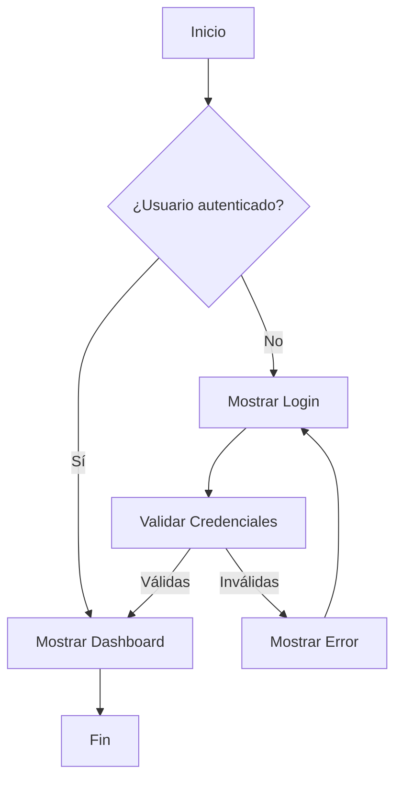
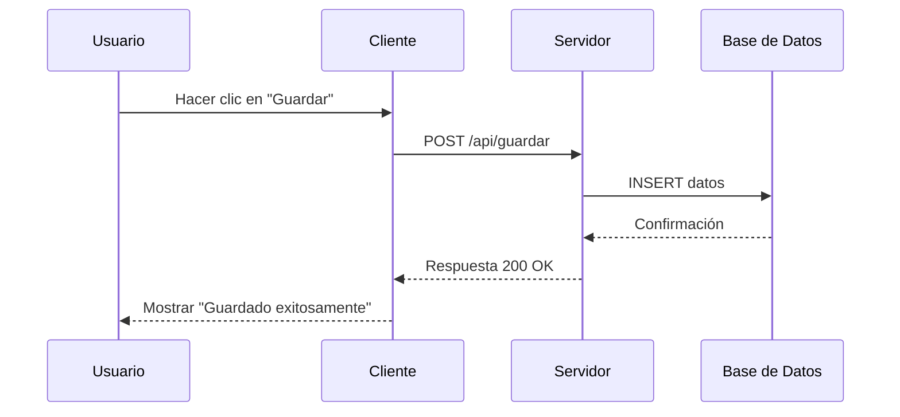
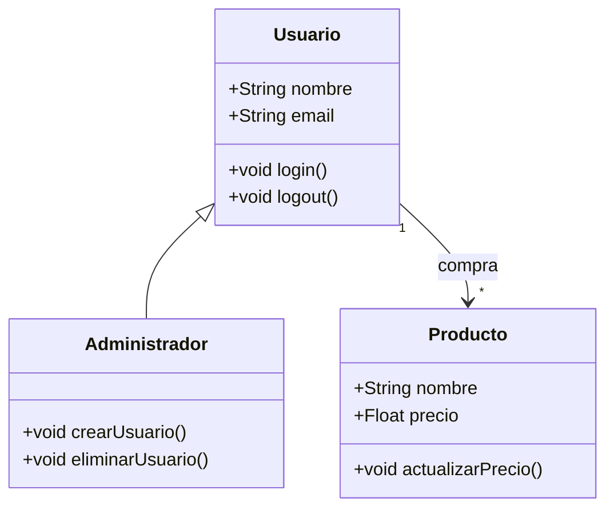
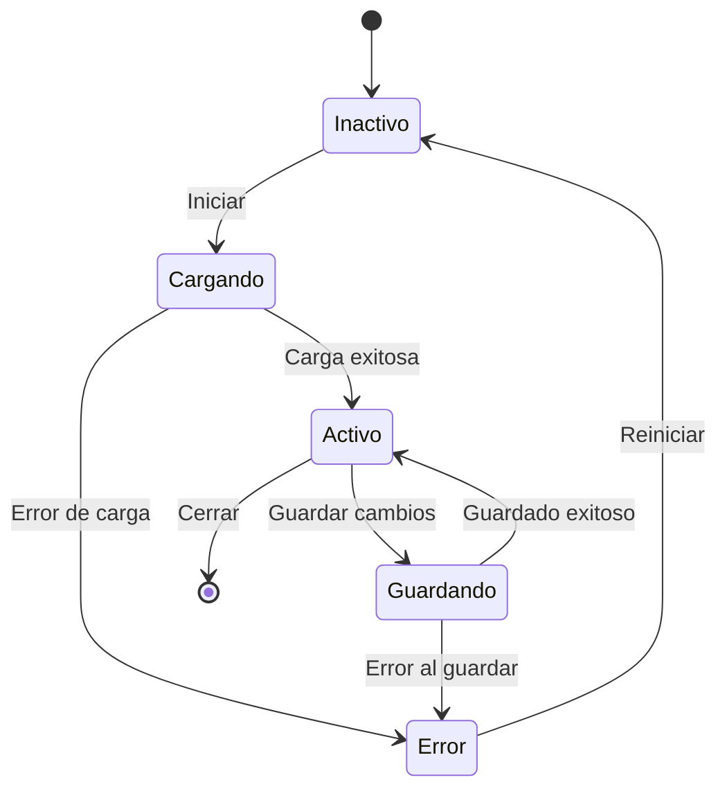
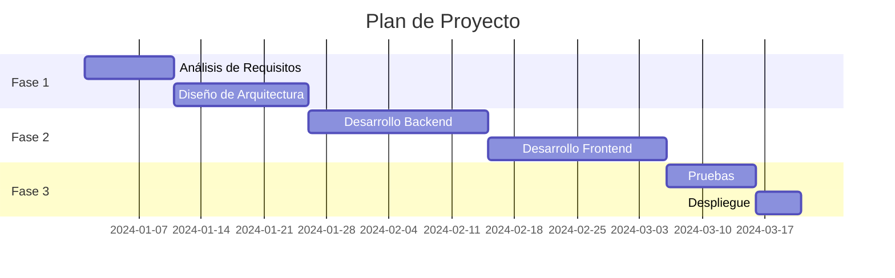
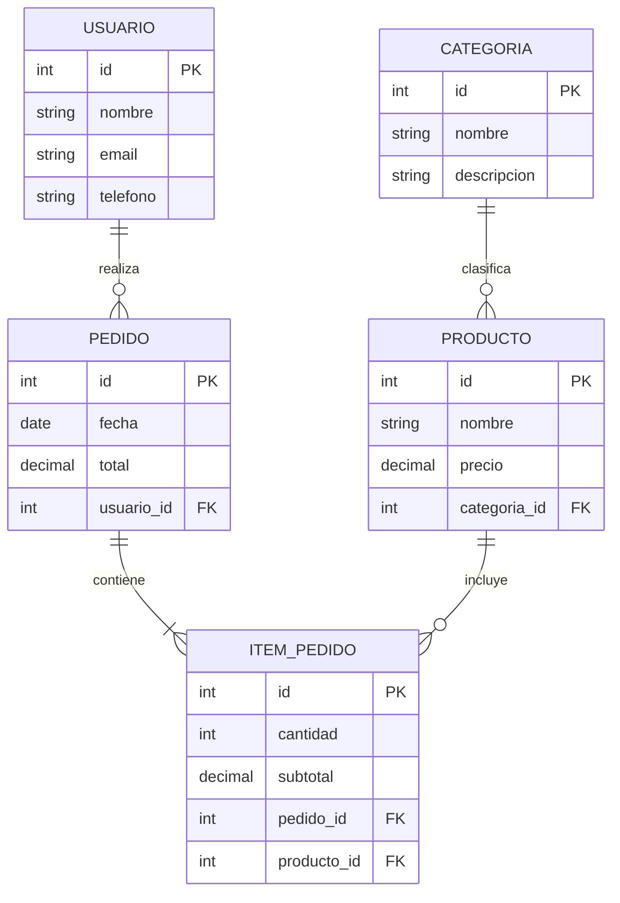

# Ejemplos de Diagramas Mermaid

Este archivo contiene varios ejemplos de diagramas que puedes usar para probar la funcionalidad de subir archivos.

## Diagrama de Flujo

## Diagrama de Secuencia

## Diagrama de Clases

## Diagrama de Estado

## Diagrama Gantt

## Diagrama Entidad-Relación

